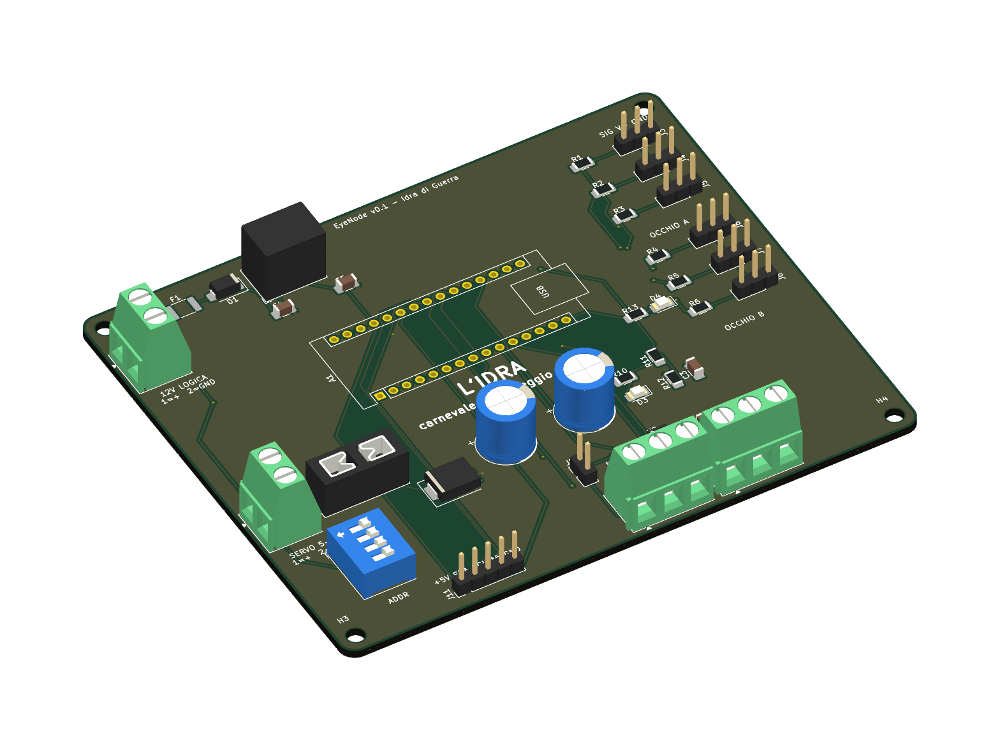
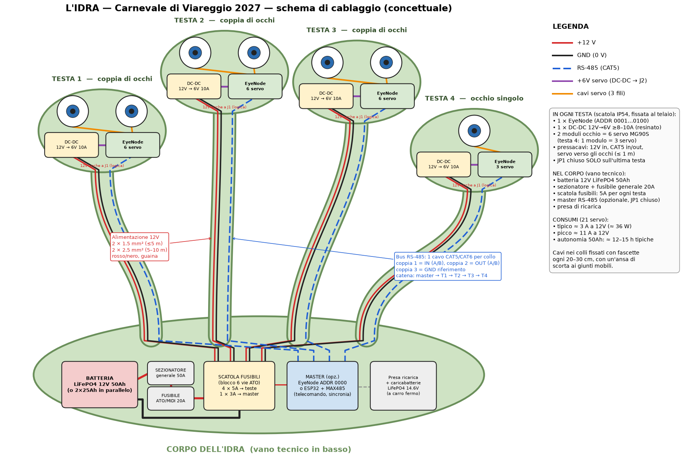

# Elettronica — Idra di Guerra



## Architettura



**7 occhi = 3 coppie + 1 singolo = 21 servo MG90S** (3 per occhio: sx/dx, su/giù, palpebre).

Una scheda **EyeNode** per ogni testa, montata vicino agli occhi (cavi servo corti):

| Nodo | Testa | Occhi | Servo | DIP ADDR |
|---|---|---|---|---|
| 1 | Testa 1 | coppia | 6 | 0001 |
| 2 | Testa 2 | coppia | 6 | 0010 |
| 3 | Testa 3 | coppia | 6 | 0011 |
| 4 | Testa 4 | singolo (solo canali A) | 3 | 0100 |

```
 Batteria / alimentatore carro 12V ──[F 20A]──┬── bus 12V ───────────────────────────────┐
                                             │                                          │
                         per ogni nodo:  [F 5A in linea]                                │
                                             ├──> J1 EyeNode (logica, R-78 -> 5V)       │
                                             └──> DC-DC 12V->6V 10A ──> J2 (servo)       │
                                                                                         │
 Nodo1 J10 ──RS485 (A,B,GND, doppino CAT5)── J9 Nodo2 J10 ── J9 Nodo3 J10 ── J9 Nodo4    │
 (JP1 chiuso sul primo e sull'ultimo nodo = terminazione 120 Ω)
```

Perché così:
- **12 V sui cavi lunghi**, conversione a 5–6 V vicino ai servo: le correnti sui cavi lunghi sono
  basse (≈ metà), quindi cadute di tensione e sezioni dei cavi restano contenute.
- **Logica separata dai servo**: l'Arduino ha il suo regolatore (R-78E5.0), quindi i picchi dei servo
  non lo resettano. Le masse sono comuni sulla scheda.
- **RS-485**: bus differenziale robusto sui metri di cavo del carro, permette di sincronizzare le teste
  (es. tutte guardano nello stesso punto). Ogni nodo funziona anche da solo (movimento autonomo).

## Scheda EyeNode v0.1 (`hardware/kicad/EyeNode`)
- 110 × 90 mm, 2 strati, fori M3 agli angoli. **Rame consigliato 2 oz (70 µm)** per le piste servo.
- Arduino Nano v3 su strip femmina (sostituibile, programmabile via USB a bordo).
- 6 uscite servo (header 2.54 mm, ordine **SIG – V+ – GND**, GND verso il bordo):
  `D3 D5 D6` = occhio A (sx/dx, su/giù, palpebre), `D9 D10 D11` = occhio B. Resistenza da 220 Ω in serie su ogni segnale.
- J1: 12 V logica (7–28 V), polyfuse 0.5 A + diodo anti-inversione.
- J2: alimentazione servo 5–6 V, fusibile a lama mini 7.5 A, diodo SS54 di protezione da inversione
  di polarità (fa saltare il fusibile), 2 × 1000 µF.
- VSERVO misurata su A7 (partitore 1:2), LED verde VSERVO, LED blu di stato su D12.
- MAX485 su D7 (TX) / D8 (RX) / D4 (DE/RE), morsetti RS-485 IN/OUT, jumper di terminazione JP1.
- DIP 4 bit su A0–A3 = indirizzo nodo. Header AUX: +5V, SDA (A4), SCL (A5), A6, GND (sensori, joystick, PIR…).
- Verifiche: ERC 0 errori; DRC 0 errori, 0 connessioni mancanti, parità schema↔PCB ok;
  restano solo avvisi minori (serigrafia, 2 raccordi termici, 2 spezzoni di pista da ripulire).

File di produzione in `hardware/kicad/EyeNode/fab/`: `EyeNode_gerber_JLCPCB.zip` (Gerber + forature),
`EyeNode_BOM.csv`, `EyeNode_pos.csv`, schema PDF, render.

Rigenerare tutto (schema → netlist → PCB → autorouting → piani di massa):
```bash
cd hardware/kicad/scripts
python gen_sch.py
kicad-cli sch export netlist -o ../EyeNode/EyeNode.net ../EyeNode/EyeNode.kicad_sch
"C:/Program Files/KiCad/10.0/bin/python.exe" gen_pcb.py
"C:/Program Files/KiCad/10.0/bin/python.exe" route.py     # Freerouting 2.1 (Java 21)
```

## Bilancio energetico
MG90S (datasheet tipico, da verificare sul lotto): ~10 mA a riposo, 150–250 mA in movimento senza carico,
**stallo ~0.7–0.9 A** a 4.8–6 V.

| | Tipico (movimento) | Picco (tutti in stallo) |
|---|---|---|
| 1 servo | 0.25 A | 0.9 A |
| EyeNode coppia (6 servo) | 1.5 A | 5.4 A |
| EyeNode singolo (3 servo) | 0.75 A | 2.7 A |
| **Totale 21 servo, lato 6 V** | **≈ 5 A (30 W)** | **≈ 19 A (113 W)** |
| Totale lato 12 V (η ≈ 90 %, + logica 4 × 50 mA) | ≈ 3 A | ≈ 11 A |

Lo stallo simultaneo di tutti i servo è un caso limite (non accade nel movimento normale), ma
alimentatori e fusibili sono dimensionati comunque per reggerlo.

### Componenti di potenza
| Voce | Specifica | Q.tà |
|---|---|---|
| DC-DC per nodo | 12 V → 6.0 V (oppure 5.0 V), **≥ 8–10 A**, possibilmente resinato/IP67 (tipo automotive) | 4 |
| Fusibile generale bus 12 V | 20 A a lama ATO, portafusibile stagno | 1 |
| Fusibile per ramo nodo (12 V) | 5 A a lama ATO in linea | 4 |
| Fusibile servo sulla scheda | 7.5 A a lama mini (nodo singolo: 5 A) | 4 |
| Sorgente 12 V | batteria LiFePO4 12 V 50 Ah nel corpo (≈ 12–15 h tipiche), con BMS ≥ 30 A | 1 |
| Sezionatore generale | 50 A, stagno | 1 |
| Scatola fusibili | blocco 6 vie ATO (4 teste + master + riserva) | 1 |

### Sezione cavi (rame, caduta di tensione ≤ 5 % andata + ritorno)
| Tratta | Corrente di progetto | Lunghezza | Sezione |
|---|---|---|---|
| Bus 12 V principale | 11 A | fino a 5 m | **4 mm²** |
| Ramo 12 V → nodo | 3 A | ≤ 5 m | **1.5 mm²** |
| Ramo 12 V → nodo | 3 A | 5–10 m | **2.5 mm²** |
| DC-DC → J2 (servo) | 6 A | ≤ 0.5 m | **1.5 mm²** |
| Prolunghe servo | 1 A | ≤ 1 m | cavo servo standard 22 AWG (0.33 mm²) |
| Prolunghe servo | 1 A | 1–2 m | 0.5 mm², segnale intrecciato con GND |
| RS-485 | — | fino a decine di m | doppino CAT5/CAT6 (A/B sulla stessa coppia) + GND |

Regole di cablaggio: puntalini su tutti i morsetti; connettori bloccabili per le parti mobili del carro;
cavi fissati e protetti nelle zone soggette a vibrazioni; schede in contenitore IP54 con pressacavi.

## Da fare
- [ ] Contenitore stampato 3D per EyeNode + DC-DC (con pressacavi)
- [ ] Firmware: porting di `single_eye`/`double_eye` (ServoEasing) + protocollo RS-485 + lettura indirizzo
- [ ] Verifica corrente di stallo reale dei MG90S acquistati e taratura fusibili
