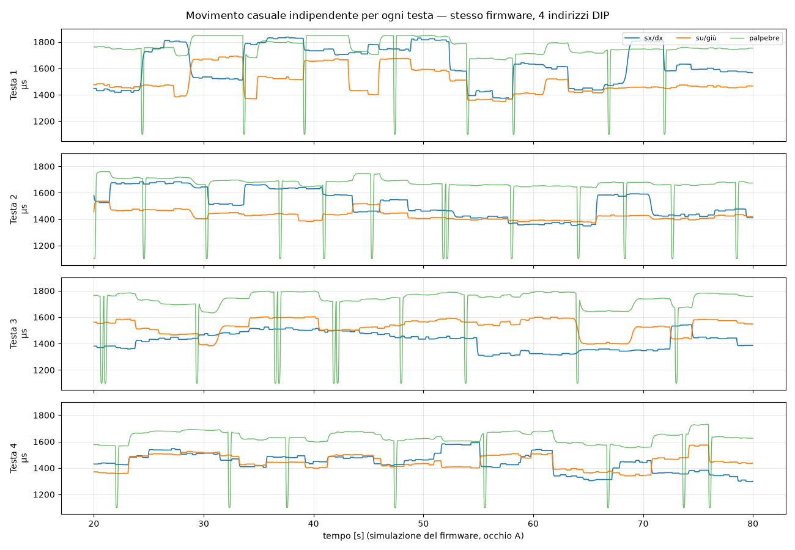

# Elettronica — Idra di Guerra


## Architettura


**7 occhi = 3 coppie + 1 singolo = 21 servo MG90S** (3 per occhio: sx/dx, su/giù, palpebre).

Una scheda **EyeNode** per ogni testa, montata vicino agli occhi (cavi servo corti). **Ogni testa è
autonoma**: muove i propri occhi in modo casuale, dentro un range, senza bus dati e senza master.
Il DIP switch serve solo a dire alla scheda quale testa è (coppia o singolo, calibrazione, seme casuale).

| Testa | Occhi | Servo | DIP ADDR |
|---|---|---|---|
| Testa 1 | coppia | 6 | 0001 |
| Testa 2 | coppia | 6 | 0010 |
| Testa 3 | coppia | 6 | 0011 |
| Testa 4 | singolo (solo canali A) | 3 | 0100 |

```
 BATT.1 6V ─(+)──(−)─ BATT.2 6V        ← in SERIE = 12 V
   (−)                    (+)
    │                      └──[F 20A]──[SEZIONATORE]──[LVD]──┬──[F 5A]──> Testa 1
    │                                                       ├──[F 5A]──> Testa 2
    │                                                       ├──[F 5A]──> Testa 3
    └──────────── GND comune ──────────────────────────────  └──[F 5A]──> Testa 4

 In ogni testa:  12V ──> J1 EyeNode (logica, R-78 → 5V)
                 12V ──> DC-DC 12V→6V 10A ──> J2 EyeNode (servo)
```

Perché così:
- **12 V sui cavi lunghi**, conversione a 6 V vicino ai servo: sui cavi lunghi la corrente è circa la metà,
  quindi cadute di tensione e sezioni dei cavi restano contenute.
- **Logica separata dai servo**: l'Arduino ha il suo regolatore (R-78E5.0), quindi i picchi dei servo
  non lo resettano. Le masse sono comuni sulla scheda.
- **Nessuna sincronia**: niente cavo dati nei colli. Un guasto in una testa non tocca le altre.

## Batteria: 2 × 6 V al piombo in serie

> ⚠️ **Serie, non parallelo.** Per ottenere 12 V da due batterie da 6 V vanno collegate **in serie**:
> il **+** della batteria 1 al **−** della batteria 2; si preleva il **−** dalla batteria 1 e il **+** dalla batteria 2.
> In **parallelo** (+ con +, − con −) la tensione resta **6 V** e si raddoppia solo la capacità: con 6 V il
> regolatore della logica (R-78E5.0, minimo 7 V) e i DC-DC 12→6 V non funzionano.
>
> Capacità: in serie la capacità è quella di **una** batteria. Due 6 V **30 Ah** in serie = **12 V 30 Ah**
> (due 6 V 15 Ah in serie farebbero 12 V 15 Ah). I calcoli qui sotto assumono **12 V 30 Ah** totali.

| Voce | Valore |
|---|---|
| Configurazione | 2 × 6 V piombo, **in serie** → 12 V nominali |
| Capacità | 30 Ah (C20) |
| Tipo consigliato | **AGM / VRLA sigillate** (niente acido libero: il carro si inclina e vibra) |
| Tensione utile | 12.7 V carica a riposo · ≈ 12.0 V al 50 % · non scendere sotto ≈ 11.5 V sotto carico |
| Ponticello serie | cavo corto 4 mm² con capicorda, morsetti protetti |
| Ricarica | caricabatterie **12 V piombo/AGM** (assorbimento 14.4–14.7 V, mantenimento 13.6–13.8 V), sulle due in serie |

### Autonomia (stima)
| | Corrente a 12 V | Note |
|---|---|---|
| Consumo tipico (21 servo in movimento casuale + 4 schede) | ≈ 3 A | stima prudente: gran parte del tempo gli occhi sono fermi a fissare |
| Picco (tutti i servo in stallo) | ≈ 11 A | caso limite; 0.37 C, la batteria lo regge |
| Energia utilizzabile al 50 % (consigliato per la durata del piombo) | ≈ 13–15 Ah | → **≈ 4–5 h** |
| Massimo assoluto (80 %) | ≈ 22 Ah | → **≈ 7 h**, ma accorcia molto la vita della batteria |

Regole per il piombo:
- **Ricaricare subito dopo ogni uscita**: lasciata scarica si solfata e perde capacità in pochi giorni.
- Le due batterie devono essere **uguali** (stesso modello, stessa età); in serie, quella più debole si
  scarica per prima. Ogni tanto controllare che le due tensioni siano simili (differenza < 0.1 V a riposo).
- Montarle fisse, in piano, lontano da scintille; le AGM non vanno caricate oltre 14.7 V.
- **Protezione sottotensione (LVD)**: un modulo 12 V da ≥ 20 A che stacca il carico a ≈ 11.5 V e lo
  riattacca a ≈ 12.5 V evita di scaricare a fondo le batterie se il carro resta acceso. In alternativa
  (o in più) il firmware può leggere la batteria su A6 con un partitore (vedi `firmware/README.md`):
  in quel caso a batteria scarica la testa chiude gli occhi e stacca i servo, ma la logica continua a
  consumare qualche decina di mA, quindi non sostituisce l'LVD.

## Serve la scatola dei fusibili?

Risposta breve: **il fusibile generale è obbligatorio, i fusibili per ogni testa sono fortemente consigliati,
la "scatola" è solo il modo più comodo di montarli** — non è indispensabile.

1. **Fusibile generale vicino alla batteria — sì, sempre.** Una batteria al piombo in cortocircuito
   eroga centinaia di ampere: senza fusibile un cavo schiacciato o spellato diventa una resistenza
   incandescente dentro un carro di cartapesta e legno con persone sopra. Va montato entro **30 cm dal
   polo +**, prima di tutto il resto (anche del sezionatore). 20 A per il cavo principale da 4 mm².
2. **Un fusibile per ogni testa — sì, ed ecco perché.** Il fusibile da 20 A protegge il cavo da 4 mm²,
   ma i rami che salgono nei colli sono da 1.5 mm²: un corto lungo un collo potrebbe far passare fino a
   20 A in un cavo da 1.5 mm² chiuso in un fascio, che si scalda ben prima che il 20 A intervenga.
   Il fusibile da 5 A per ramo protegge quel cavo e, in più, **se una testa si guasta si spegne solo
   quella**: le altre tre continuano a muoversi per tutta la sfilata.
3. **Il fusibile sulla scheda (F2, 7.5 A) non basta**: sta *dopo* il DC-DC, quindi protegge il lato 6 V
   dei servo ma non il cavo 12 V che sale nel collo.
4. **Scatola o no?** Con 4 rami bastano 4 **portafusibili in linea stagni** (ATO, pochi euro l'uno). Un
   blocchetto fusibili a 4–6 vie fa la stessa cosa ma è più ordinato: un unico punto da ispezionare,
   ricambi a portata di mano, cablaggio più pulito nel vano tecnico. È una scelta di comodità.
5. L'unico modo di farne a meno sarebbe portare il 4 mm² fino a ogni testa (più rame, più peso, e un
   guasto in una testa spegne tutto). Non conviene.

## Scheda EyeNode v0.2 (`hardware/kicad/EyeNode`)
- 110 × 90 mm, 2 strati, fori M3 agli angoli. **Rame consigliato 2 oz (70 µm)** per le piste servo.
- Arduino Nano v3 su strip femmina (sostituibile, programmabile via USB a bordo).
- 6 uscite servo (header 2.54 mm, ordine **SIG – V+ – GND**, GND verso il bordo):
  `D3 D5 D6` = occhio A (sx/dx, su/giù, palpebre), `D9 D10 D11` = occhio B. Resistenza da 220 Ω in serie su ogni segnale.
- J1: 12 V logica (7–28 V), polyfuse 0.5 A + diodo anti-inversione.
- J2: alimentazione servo 5–6 V, fusibile a lama mini 7.5 A, diodo SS54 di protezione da inversione
  di polarità (fa saltare il fusibile), 2 × 1000 µF.
- VSERVO misurata su A7 (partitore 1:2), LED verde VSERVO, LED blu di stato su D12
  (lampeggia N volte ogni 3 s, N = numero della testa).
- DIP 4 bit su A0–A3 = indirizzo testa. Header AUX: +5V, SDA (A4), SCL (A5), A6, GND
  (A6 = misura batteria opzionale, oppure sensori).
- **v0.2: rimossi MAX485, terminazione 120 Ω, jumper JP1 e morsetti RS-485 IN/OUT** (nessuna sincronia).
  D4, D7, D8 restano liberi.
- Verifiche: ERC 0 errori; DRC 0 errori, 0 connessioni mancanti, parità schema↔PCB ok;
  restano solo 3 avvisi di serigrafia (testo "SERVO 5-6V" vicino al DIP switch).

File di produzione in `hardware/kicad/EyeNode/fab/`: `EyeNode_gerber_JLCPCB.zip` (Gerber + forature),
`EyeNode_BOM.csv`, `EyeNode_pos.csv`, schema PDF, render.

Rigenerare tutto (schema → netlist → PCB → autorouting → piani di massa):
```bash
cd hardware/kicad/scripts
python gen_sch.py
kicad-cli sch export netlist -o ../EyeNode/EyeNode.net ../EyeNode/EyeNode.kicad_sch
"C:/Program Files/KiCad/10.0/bin/python.exe" gen_pcb.py
"C:/Program Files/KiCad/10.0/bin/python.exe" route.py     # Freerouting 2.1 (Java 21)
"C:/Program Files/KiCad/10.0/bin/python.exe" add_logo_text.py
```

## Firmware
`firmware/EyeNode_random/` — stesso sketch su tutte le schede, movimento casuale e indipendente per
ogni testa. Dettagli, taratura e comandi in [firmware/README.md](../firmware/README.md).



## Bilancio energetico
MG90S (datasheet tipico, da verificare sul lotto): ~10 mA a riposo, 150–250 mA in movimento senza carico,
**stallo ~0.7–0.9 A** a 4.8–6 V.

| | Tipico (movimento) | Picco (tutti in stallo) |
|---|---|---|
| 1 servo | 0.25 A | 0.9 A |
| EyeNode coppia (6 servo) | 1.5 A | 5.4 A |
| EyeNode singolo (3 servo) | 0.75 A | 2.7 A |
| **Totale 21 servo, lato 6 V** | **≈ 5 A (30 W)** | **≈ 19 A (113 W)** |
| Totale lato 12 V (η ≈ 90 %, + logica 4 × 50 mA) | ≈ 3 A | ≈ 11 A |

Lo stallo simultaneo di tutti i servo è un caso limite (non accade nel movimento normale), ma
alimentatori e fusibili sono dimensionati comunque per reggerlo. Il firmware aggancia i servo uno alla
volta e fa partire le teste sfasate, così all'accensione non c'è un unico grande spunto.

### Componenti di potenza
| Voce | Specifica | Q.tà |
|---|---|---|
| Batterie | 6 V 30 Ah piombo AGM/VRLA, **collegate in serie** | 2 |
| Ponticello serie | cavo 4 mm² corto con capicorda | 1 |
| Fusibile generale | 20 A a lama ATO/MIDI, portafusibile stagno, **≤ 30 cm dal +** | 1 |
| Sezionatore generale | ≥ 30 A, stagno | 1 |
| Protezione sottotensione (LVD) | 12 V, ≥ 20 A, stacco ≈ 11.5 V / riattacco ≈ 12.5 V | 1 |
| Fusibili di ramo | 5 A ATO: blocchetto 4–6 vie **oppure** 4 portafusibili in linea stagni | 4 |
| DC-DC per testa | 12 V → 6.0 V (oppure 5.0 V), **≥ 8–10 A**, ingresso almeno 9–16 V, resinato/IP67 (tipo automotive) | 4 |
| Fusibile servo sulla scheda | 7.5 A a lama mini (testa singola: 5 A) | 4 |
| Caricabatterie | 12 V piombo/AGM, 3–6 A, con mantenimento | 1 |

### Sezione cavi (rame, caduta di tensione ≤ 5 % andata + ritorno)
| Tratta | Corrente di progetto | Lunghezza | Sezione |
|---|---|---|---|
| Batteria → fusibili di ramo (e ponticello serie) | 11 A | fino a 5 m | **4 mm²** |
| Ramo 12 V → testa | 3 A | ≤ 5 m | **1.5 mm²** |
| Ramo 12 V → testa | 3 A | 5–10 m | **2.5 mm²** |
| DC-DC → J2 (servo) | 6 A | ≤ 0.5 m | **1.5 mm²** |
| Prolunghe servo | 1 A | ≤ 1 m | cavo servo standard 22 AWG (0.33 mm²) |
| Prolunghe servo | 1 A | 1–2 m | 0.5 mm², segnale intrecciato con GND |

Regole di cablaggio: puntalini su tutti i morsetti; connettori bloccabili per le parti mobili del carro;
cavi fissati e protetti nelle zone soggette a vibrazioni; schede in contenitore IP54 con pressacavi.

## Da fare
- [ ] Contenitore stampato 3D per EyeNode + DC-DC (con pressacavi)
- [x] Firmware autonomo casuale (`firmware/EyeNode_random`)
- [ ] Taratura sul carro: limiti meccanici di ogni occhio in `config.h`
- [ ] Verifica corrente di stallo reale dei MG90S acquistati e taratura fusibili
- [ ] Verificare la capacità della singola batteria da 6 V (30 Ah ciascuna → 12 V 30 Ah in serie)
