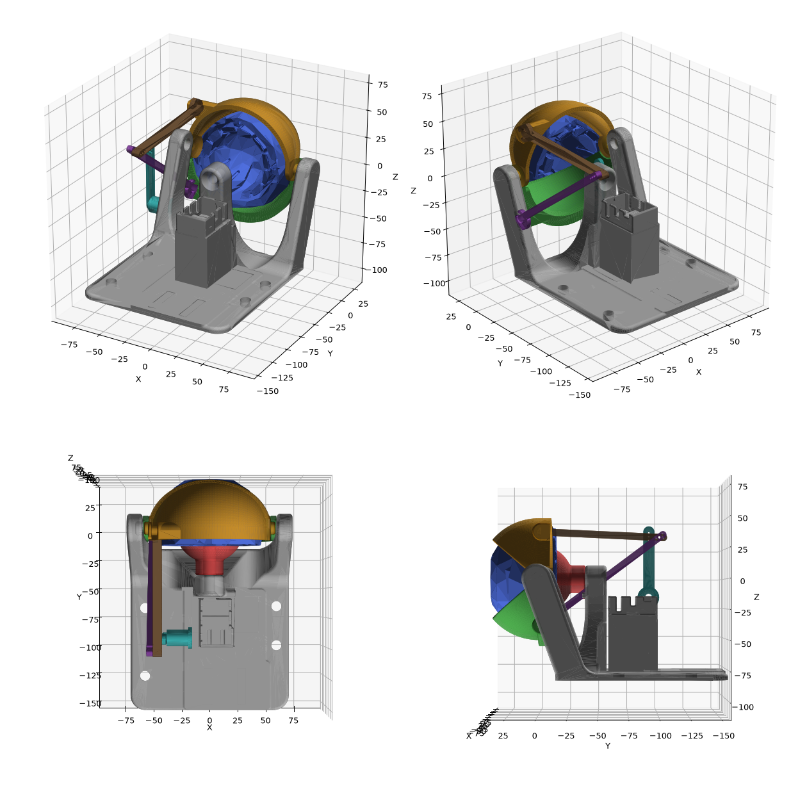

# Occhi animatronici ingranditi — note di progetto

## Cosa viene scalato e cosa no
Fattore `k = D / 35` (D50 → 1.43, D70 → 2.00, D90 → 2.57), centro di scala = centro occhio.

| Pezzo | Trattamento |
|---|---|
| Bulbo, snodo sferico, palpebre sup./inf. | scalati uniformemente di k |
| BasePlate: piastra, montanti palpebre, torre snodo | scalati di k |
| **BasePlate: vano servo** | **1:1 originale**, ritagliato e trapiantato dietro la torre, alla stessa quota rispetto al centro occhio, su un piedistallo |
| Tiranti palpebre | rigenerati: testa d'innesto scalata + corpo dritto + 3 fori di regolazione (±3 mm) |
| `LidCrank` (nuovo) | prolunga per la squadretta del servo palpebre: braccio di raggio k·r, così gli angoli servo restano quelli originali |
| `HornExtender` (nuovo) | prolunga per le squadrette dei 2 servo occhio, fila di fori ogni 2.5 mm per il filo |

Perché le prolunghe: con servo e squadrette 1:1 e leve sull'occhio k volte più grandi, la stessa
corsa del servo darebbe un angolo dell'occhio k volte minore. Allungando il braccio di k la
cinematica torna simile all'originale e la calibrazione (`calibration.ino`) resta valida come punto di partenza.

## Viteria e materiali per taglia
| | D50 | D70 | D90 |
|---|---|---|---|
| Vite snodo (orig. M3) | M4 + inserto M4 | M6 + inserto M6 | M8 + inserto M8 |
| Foro inserto nello snodo | 5.9 mm | 8.2 mm | 10.5 mm |
| Fori fissaggio piastra | 5.0 mm | 7.0 mm | 9.0 mm |
| Filo armonico occhio (orig. 1 mm) | 1.5 mm | 2.0 mm | 2.5 mm |
| Tiranti palpebre ↔ LidCrank | viti M2 | viti M2 | viti M2 |
| Raggio braccio palpebre | 27.9 mm | 39.1 mm | 50.2 mm |
| Ingombro BasePlate (X×Y×Z) | 77×94×53 | 108×131×74 | 138×168×95 |

La zona libera della piastra dietro al vano servo (molto ampia in D70/D90) è pensata per il
fissaggio della scheda di controllo.

## Montaggio — differenze rispetto all'originale
1. Servo, squadrette e vano: identici all'originale (MG90S consigliati).
2. Centrare i servo a 90° **prima** di montare le prolunghe (come da istruzioni originali).
3. `LidCrank`: appoggiarlo sulla squadretta del servo palpebre, forare Ø1.5 attraverso i fori della
   squadretta e fissare con 2 viti M2 autofilettanti; foro centrale Ø6.4 per la vite della squadretta.
   A 90° il braccio deve puntare verso l'alto.
4. Tiranti: una vite M2 lunga attraversa tirante inferiore, tirante superiore e braccio. Scegliere la
   coppia di fori (tirante/braccio) che dà palpebre centrate a servo a 90°.
5. `HornExtender`: stesso fissaggio sulla squadretta; il filo va nel foro al raggio ≈ k × raggio usato in origine.

## Da verificare con la prima stampa (consigliato: D50)
- Asse del servo palpebre stimato da foto e geometria (`LID_SERVO_AXIS` nello script): i fori di
  regolazione compensano ±3 mm, ma va confermato.
- Le tolleranze di stampa si scalano con k (giochi più ampi nelle taglie grandi): verificare
  l'innesto a scatto bulbo–snodo e palpebre–montanti.
- Coppia: con D90 i bulbi pesano ~5-6 volte l'originale; gli MG90S (2.2 kg·cm) restano nel margine
  per movimenti fluidi, ma evitare scatti troppo bruschi (ServoEasing).

## Licenza
Il progetto originale è **CC BY-NC-SA 4.0** (attribuzione, **non commerciale**, condividi allo stesso
modo). I file derivati qui sono soggetti alla stessa licenza. Un carro allegorico ha
un contesto commerciale/professionale: **chiedere il permesso all'autore (MorganManly)** prima dell'uso sul carro,
oppure ridisegnare da zero i pezzi.

## Versione COPPIA (double)
File in `mechanical/eyes/scaled/double/D50|D70|D90/`. Anteprima: `docs/img/confronto_taglie_coppia.png`.

- Base dalla versione "double compact" originale: due vani servo 1:1 (sx e dx speculare), vano
  centrale (supporti protoboard + foro connettore alimentazione) scalato di k.
- Pezzi `_x2` / `_x4` = da stampare 2 / 4 volte (bulbo, snodo, prolunghe squadrette).
- Pezzi `_L` / `_R` = occhio sinistro / destro (palpebre, tiranti, LidCrank speculari).

| | D50 | D70 | D90 |
|---|---|---|---|
| Interasse occhi | 94.0 mm | 131.6 mm | 169.2 mm |
| Ingombro BasePlate_Double (X×Y×Z) | 171×94×53 | 239×131×74 | **308**×168×95 |

⚠️ La BasePlate_Double D90 (308 mm) non entra nei piatti comuni (220–256 mm): va divisa in due
metà con giunzione (posso generarla con incastro a coda di rondine + viti) oppure si usano due
moduli singoli affiancati. La D70 (239 mm) entra in piatti da 256 mm (es. Bambu X1/P1).
